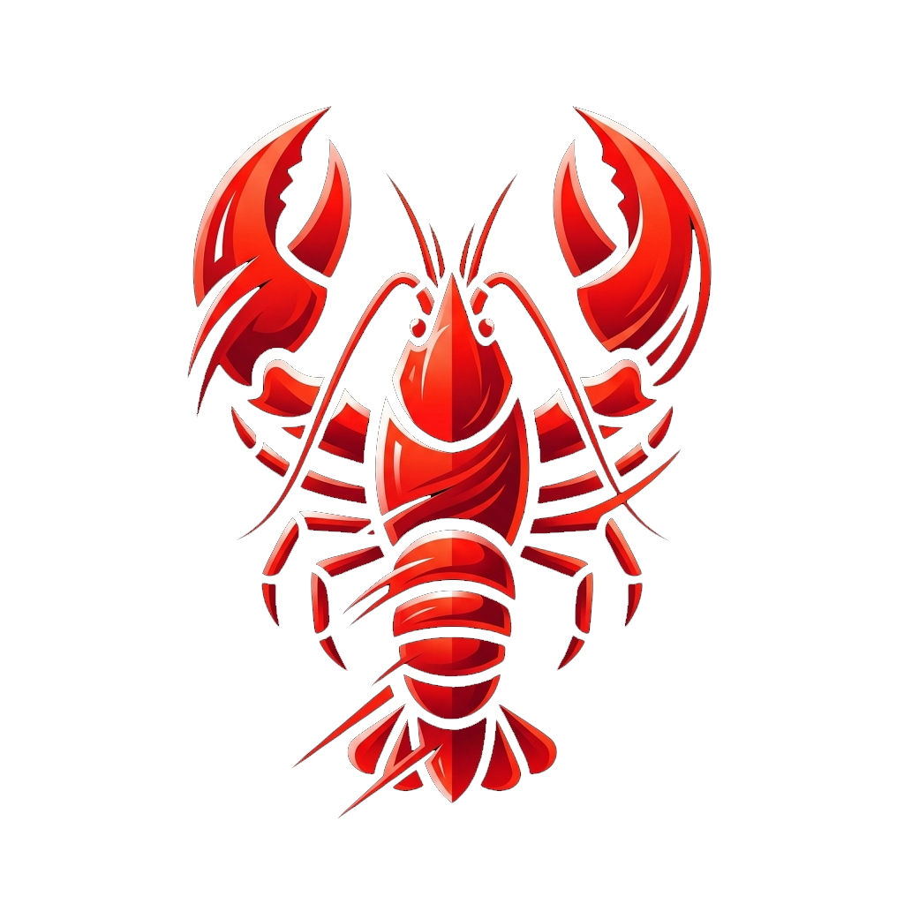

<div align="center">
  
  <h1>ClawExpress</h1>
  <p><strong>The Ultimate Desktop Manager for OpenClaw AI Gateways & Workflows</strong></p>
  
  <p>
    <a href="#-about">About</a> •
    <a href="#-features">Features</a> •
    <a href="#-getting-started">Getting Started</a> •
    <a href="#-usage-guide">Usage Guide</a> •
    <a href="#-developer-guide">Developer Guide</a>
  </p>

  <p>
    <a href="https://discord.gg/qMx3jkWCs">
      
    </a>
  </p>
</div>

---

## ℹ️ About

**ClawExpress** is a sleek, modern desktop application built with Electron and React designed to manage, configure, and operate AI Gateway (OpenClaw) instances directly from your local machine.

With ClawExpress, you can seamlessly connect your language models to various chat platforms, manage complex provider dependencies securely, and monitor your AI agents in real-time, all wrapped in a premium frameless desktop interface.

Our core philosophy is to simplify the bridge between powerful LLMs and every-day messaging channels, ensuring users don't need a doctorate in DevOps to spin up an AI companion on WhatsApp or Zalo.

💬 **Join the Conversation**: Have questions, need help setting up, or want to discuss feature ideas? Hop into our official [ClawExpress Discord Server](https://discord.gg/qMx3jkWCs)!

## ✨ Features

- 🖥️ **Unified Workspace**: 
  - Manage multiple AI platform instances out of one centralized dashboard. Start, stop, and monitor processes with real-time health checks.
- 🔌 **Dynamic Connection Hub**:
  - Securely manage your API keys, OAuth tokens, and local AI proxy endpoints (Ollama, LM Studio) locally.
  - Your credentials never leave your machine.
- 💬 **One-Click Chat Integrations**:
  - Built-in multi-channel support for **WhatsApp**, **Zalo Personal**, **Telegram**, **Discord**, and **Slack**.
  - Headless QR-code scanning directly via the UI.
- 🛠️ **System & Tray Native**:
  - Launch silently at Windows startup, minimize to the system tray, and run workloads in the background seamlessly.
- 📦 **Dual Execution Modes (Docker & Native)**: 
  - Run OpenClaw natively via Node.js OR isolate the gateway entirely using Docker containers with mounted `.openclaw` volumes.

## 🚀 Getting Started

### System Requirements & Prerequisites

Depending on how you choose to run the OpenClaw Gateway (Native vs. Isolated), please ensure your system meets the corresponding requirements:

**1. For Native Runtime (NPM)**
- **OS**: Windows 10/11, macOS 12+, or Linux.
- **Environment**: [Node.js](https://nodejs.org/en/) (v18.0.0 or higher) and NPM.
- **Requirement**: The OpenClaw CLI must be installed globally on your machine (`npm install -g openclaw`).

**2. For Isolated Runtime (Docker / Podman)**
- **OS**: Windows 10/11 (with WSL2/Hyper-V), macOS, or Linux.
- **Engine**: **Docker Desktop** OR **Podman** (configured with Docker CLI compatibility/alias).
- **Requirement**: The container daemon must be running in the background before hitting 'Start' in ClawExpress.

**3. To Build ClawExpress from Source (Developers)**
- Node.js (v18+) and Git.
- NPM or Yarn package manager.

### Download & Installation (End Users)

Head over to the [GitHub Releases](https://github.com/ClawKits/ClawExpress/releases) page to download the latest compiled version for your operating system.

#### 🪟 Windows (.exe)
1. Download the `ClawExpress-Setup.exe` file.
2. Double-click the installer and follow the on-screen instructions.
3. *If Windows Defender SmartScreen prevents the app from starting, click **More info** -> **Run anyway**.*

#### 🍏 macOS (.dmg)
1. Download the `ClawExpress-macOS.dmg` file.
2. Open the `.dmg` and drag the **ClawExpress** app into your `Applications` folder.
3. **Important Note on Gatekeeper:** Since this application is open-source and not signed by an Apple Developer Certificate, macOS may actively block the launch.
   - **If you see "Cannot be opened because the developer cannot be verified":** Open your `Applications` folder in Finder, **Right-Click** (or Control-Click) on the ClawExpress app, and select **Open**. A dialog will appear asking you to confirm; click **Open** again.
   - **If you see "ClawExpress is damaged and can't be opened":** Apple has quarantined the unsigned app. Open your **Terminal** app and run the following command to clear the quarantine flag:
     ```bash
     xattr -cr /Applications/ClawExpress.app
     ```
     *After running this command, you can open the app normally. You only need to do this once!*

#### 🐧 Linux (.AppImage / .deb)
1. Download the appropriate `.AppImage` or `.deb` file for your distribution.
2. If using `.AppImage`, ensure you make it executable before running:
   ```bash
   chmod +x ClawExpress-Linux.AppImage
   ./ClawExpress-Linux.AppImage
   ```

### Building from Source (For Developers)

1. **Clone the repository:**
   ```bash
   git clone https://github.com/ClawKits/ClawExpress.git
   cd ClawExpress/app
   ```

2. **Install dependencies:**
   ```bash
   npm install
   ```

3. **Start Development Mode:**
   ```bash
   npm run dev
   ```
   *This starts the Vite React server and boots up the Electron window simultaneously.*

4. **Build for Production (Executable):**
   ```bash
   npm run build
   ```
   *The compiled installer will be available in the `dist` directory.*

## 📖 Usage Guide

ClawExpress connects external messaging channels (Zalo, WhatsApp, Telegram) with your AI endpoints seamlessly.

### 1. Starting the Gateway
- Open the application and ensure your OpenClaw installation is recognized.
- Choose between **Docker Mode** (Recommended for isolation) or **Native Mode**.
- Click the **Start Gateway** button (Power Icon). The dashboard will indicate a green status when the WebSocket RPC is healthy.

### 2. Linking Channels (Zalo & WhatsApp)
- Go to the **Channel Settings** for Zalo or WhatsApp.
- Click **Link Account**. ClawExpress will automatically negotiate with the Gateway (pausing it if necessary to avoid SQLite locks) and extract the pairing QR Code.
- Scan the QR code using your Zalo or WhatsApp mobile app. Once scanned, the channel is permanently linked.

### 3. Safety & Pairing Mode
By default, new channels are placed into **Pairing Mode** to prevent unauthorized messages from hitting your API keys.
1. Send a message to your newly linked Bot/Number.
2. The bot will automatically reply with an 8-character Pairing Code.
3. Open ClawExpress, go to the Channel's **Settings**, enter the 8-character code, and click **Accept**.
4. The system directly communicates with the Gateway (`openclaw pairing approve`) to permanently whitelist your user account!

## 🛠️ Developer Guide

ClawExpress heavily utilizes Electron's IPC bridge to safely execute OS-level commands (Docker, PowerShell) whilst shielding the Chromium Renderer.

### Architecture Overview

```text
clawexpress/
├── app/
│   ├── public/              # Static assets (logos, icons)
│   ├── src/
│   │   ├── components/      # React UI components (Zustand, Lucide-React)
│   │   ├── main/            # Electron Main Process (IPC Handlers, Process Managers)
│   │   ├── preload/         # Electron Context Bridge (Strict IPC Whitelists)
│   │   └── App.jsx          # React Application Root
│   ├── index.html           # Vite HTML Entry
│   ├── package.json         # Dependencies & Build Scripts
│   └── vite.config.js       # Vite Bundler configuration
```

### IPC Bridge (Context Isolation)
All commands executed by the UI are routed through `preload.js` to ensure extreme security. 
If you create a new IPC handler in the Main process (e.g., `ipcMain.handle('my-new-action')`), you **MUST** whitelist it in `src/preload/preload.js` inside the `VALID_CHANNELS` array. Failure to do so will result in a `Blocked IPC channel` promise rejection.

### The Docker Execution Flow
When running in Docker mode, ClawExpress utilizes `docker exec` to mutate state cleanly without recreating containers:
1. Volumes: `~/.openclaw` is mounted to `/home/node/.openclaw` to persist the SQLite registry natively across host and container walls.
2. QR Extraction: Temporary files (like Zalo QR codes) dumped inside the isolated container's `/tmp` are extracted asynchronously onto the host using cross-platform terminal queries (e.g., `find /tmp -name "*.png" -exec cp ...`), bypassing the strict overlay-fs security measures without lowering container integrity.

## 🤝 Contributing & Community

We strongly believe in the power of the open-source community to make **ClawExpress** the best AI Gateway Manager in the world! Whether you are fixing a UI glitch, adding a new AI provider, or deeply optimizing our Electron IPC bridge, your contributions are highly valued.

### How to Contribute

1. **Fork the Repository**: Start by forking the project to your own GitHub account.
2. **Create a Feature Branch**: `git checkout -b feature/amazing-new-idea`
3. **Commit your Changes**: Write clear, descriptive commit messages.
4. **Push to the Branch**: `git push origin feature/amazing-new-idea`
5. **Open a Pull Request (PR)**: Submit your PR against the `main` branch of this repository. Please attach screenshots if your changes affect the UI!

### 💡 What we need help with right now
- **New Messaging Channels**: Adding integrations for Slack, Teams, Line, etc.
- **Provider Support**: Expanding the local proxy connections (LM Studio, vLLM).
- **UI/UX Polish**: Dark/Light mode improvements, better animations, and accessibility.

### Code Guidelines
- **UI Components**: Any new React components should utilize `css-modules` or inline styling aligning with the existing premium aesthetics.
- **Electron Main Process**: Destructive commands (file writing, shell execution) **MUST** be thoroughly wrapped in `try/catch` on the Main process side to prevent the Electron shell from crashing.
- **IPC Safety**: Whenever you expose a new IPC method, remember to whitelist it in `app/src/preload/preload.js`.


### Found a Bug or Have a Suggestion?
If you're not ready to write code yet, you can still contribute immensely by opening an **Issue** on GitHub. Describe the bug you encountered or the workflow feature you think ClawExpress needs!


## 📜 License & Terms of Use

This project is released under a **Dual-License** model (Source-Available, Non-Commercial).

1. **Personal & Educational Use**: You are free to use, modify, and distribute this software for personal, educational, or open-source (non-profit) purposes. 
2. **Commercial Use is Strictly Prohibited**: You may **NOT** use this software, its source code, or any of its components to build, integrate, or operate applications intended for commercial use or monetization.
3. **Commercial Licensing**: If you wish to use ClawExpress (or its source code) for commercial purposes, please contact the author to acquire a commercial license.

**Contact for Commercial Usage:**  
📧 `johnliam365@gmail.com`

*(For specific legal text, this repository aligns closely with the principles of the **Creative Commons Attribution-NonCommercial 4.0 International (CC BY-NC 4.0)** license).*
